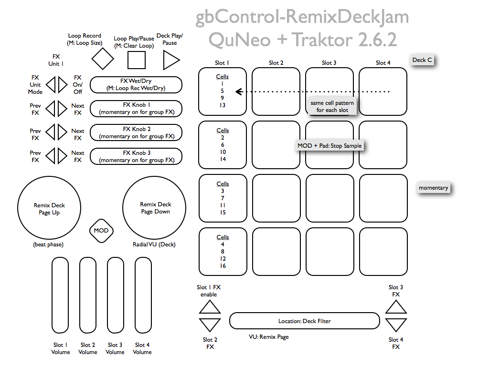

# README

[QuNeo](http://www.keithmcmillen.com/QuNeo/overview) + [Traktor 2.6.2](http://www.native-instruments.com/) Remix Deck gbControl mapping version 1.0.

Requires Traktor Pro 2.6.2 for full remix deck control.

**Credit:** The base of the tsi was adapted from [Stewe's MFSpectra mapping](https://maps.djtechtools.com/mappings/1681) because Traktor's controller manager is an excercise in time-to-RSI like no other. There a chunk of unused cruft in the .tsi as a result. 

**License:** Please distribute. Please improve. Credit me if you fork and/or distribute. Above all, distribute and improve on this template ([CC-BY](http://creativecommons.org/licenses/by/3.0/)).

Thanks, – gb

---

